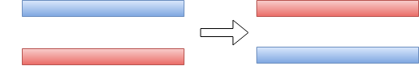
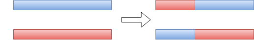
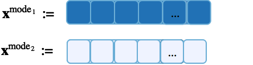
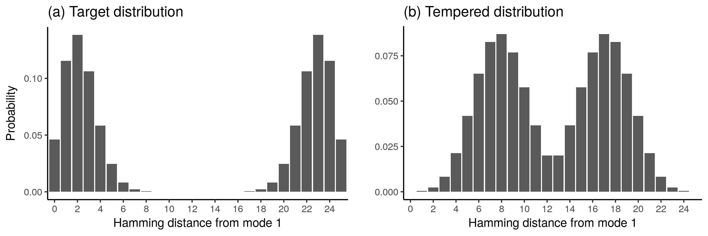
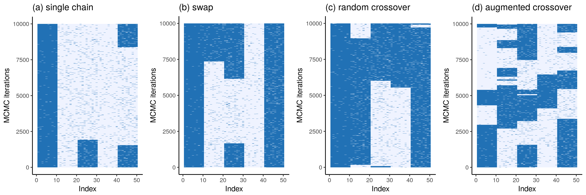
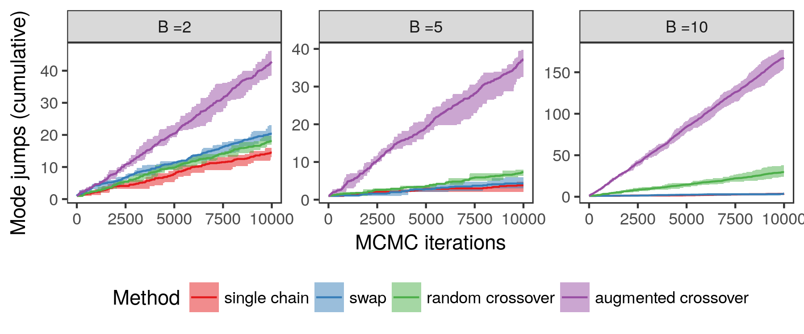

```{r setup, include=FALSE}
options(htmltools.dir.version = FALSE)
```

background-image: url(fig/PT_0.png)
background-position: 50% 80%
background-size: 60%

$$\def\sc#1{\dosc#1\csod}
\def\dosc#1#2\csod{{\rm #1{\small #2}}}
\newcommand{\ee}{\text{rest}}
\newcommand{\boldx}{\mathbf{x}}
\newcommand{\boldy}{\mathbf{y}}
\newcommand{\boldz}{\mathbf{z}}
\newcommand{\boldu}{\mathbf{u}}
\newcommand{\boldU}{\mathbf{U}}
\newcommand{\boldV}{\mathbf{V}}
\newcommand{\boldv}{\mathbf{v}}
\newcommand{\boldX}{\mathbf{X}}
\newcommand{\boldZ}{\mathbf{Z}}
\newcommand{\boldw}{\mathbf{w}}
\newcommand{\boldW}{\mathbf{W}}
\newcommand{\boldI}{\mathbf{I}}
\newcommand{\boldR}{\mathbf{R}}
\newcommand{\N}{\mathcal{N}}
\newcommand{\dist}{\text{dist}}$$


# Background

Bayesian inference for high-dimensional models is challenging: it is difficult to explore multimodal distributions.

---
background-image: url(fig/PT_1.png)
background-position: 50% 80%
background-size: 60%

# Parallel tempering 

--

Instead of simply targeting $\pi(x)$, 
introduce a temperature ladder $T_1 < T_2 < \ldots < T_K$ and run multiple MCMC chains, with chain $k$ targeting
$$ \pi(x)^{\beta_k} \text{  where  } \beta_k = 1/T_k$$

---
background-image: url(fig/PT_2.png)
background-position: 50% 80%
background-size: 60%

# How to exchange information between an ensemble of chains

---

# How to exchange information between an ensemble of chains

--
1. **Swap move**: Propose to swap (using Metropolis-Hastings to accept/reject)
    
    

    Inefficient in a high-dimensional setting
--
2. **Genetic algorithms**:

    One-point **crossover** (using Metropolis-Hastings to accept/reject)

    
    
---
# Augmented Ensemble MCMC


We construct an auxiliary variable Gibbs sampler, using a one-point crossover

---
background-image: url(fig/schema_crossover_step1.png)
background-position: 50% 90%
background-size: 70%

# Augmented Ensemble MCMC


We construct an auxiliary variable Gibbs sampler, using a one-point crossover

1. Generate auxiliary $(\boldu, \boldv) \sim p(\boldu, \boldv | \boldx_i, \boldx_j)$

     * Uniform distribution over all crossovers of $(\boldx_i, \boldx_j)$


---
background-image: url(fig/schema_crossover_step2.png)
background-position: 50% 90%
background-size: 70%

# Augmented Ensemble MCMC


We construct an auxiliary variable Gibbs sampler, using a one-point crossover

1. Generate auxiliary $(\boldu, \boldv) \sim p(\boldu, \boldv | \boldx_i, \boldx_j)$

     * Uniform distribution over all crossovers of $(\boldx_i, \boldx_j)$

2. Generate $(\boldx_i, \boldx_j) \sim p(\boldx_i, \boldx_j | \ee)$, where
$$\begin{align*}
p(\boldx_i, \boldx_j | \ee) &= \frac{1}{Z} \pi_i(\boldx_i) \pi_j(\boldx_j)  p(\boldu, \boldv | \boldx_i, \boldx_j) \\
&= \frac{1}{Z} \pi_i(\boldx_i) \pi_j(\boldx_j)  p(\boldx_i, \boldx_j | \boldu, \boldv) \\
&= \frac{1}{Z} \pi_i(\boldx_i) \pi_j(\boldx_j) I((\boldx_i, \boldx_j) \in \text{Crossover} (\boldu, \boldv)) 
\end{align*}$$

---

# Toy example

Consider the following distribution over binary vectors with two separated modes:



--



---
background-image: url(fig/toy_multimodal.png)
background-position: 50% 60%
background-size: 60%

# Toy example extended

Divide $\boldx$ into $B$ blocks, within each block bimodal distribution. 

Results in a total of $2^B$ modes:

---

# Toy example: comparison of samplers


* Single chain Gibbs sampler
* Ensemble of Gibbs samplers (two chains: $T_1 = 1$, $T_2 = 4$), 
--
using the following exchange moves
    * Swap (accept/reject)
    * Uniformly chosen crossover (accept/reject)
    * Augmented crossover

--



---

# Toy example: comparison of samplers

Number of mode jumps (cumulative)


