```{r setup, include=FALSE}
options(htmltools.dir.version = FALSE)
```

background-image: url(fig/PT_0.png)
background-position: 50% 80%
background-size: 60%

# Background

Bayesian inference for high-dimensional models is challenging: it is difficult to explore multimodal distributions.

$$\def\sc#1{\dosc#1\csod}
\def\dosc#1#2\csod{{\rm #1{\small #2}}}
\newcommand{\ee}{\text{rest}}
\newcommand{\boldx}{\mathbf{x}}
\newcommand{\boldy}{\mathbf{y}}
\newcommand{\boldz}{\mathbf{z}}
\newcommand{\boldu}{\mathbf{u}}
\newcommand{\boldU}{\mathbf{U}}
\newcommand{\boldV}{\mathbf{V}}
\newcommand{\boldv}{\mathbf{v}}
\newcommand{\boldX}{\mathbf{X}}
\newcommand{\boldZ}{\mathbf{Z}}
\newcommand{\boldw}{\mathbf{w}}
\newcommand{\boldW}{\mathbf{W}}
\newcommand{\boldI}{\mathbf{I}}
\newcommand{\boldR}{\mathbf{R}}
\newcommand{\N}{\mathcal{N}}
\newcommand{\dist}{\text{dist}}$$

---
background-image: url(fig/PT_1.png)
background-position: 50% 80%
background-size: 60%

# Parallel tempering 

--

Instead of simply targeting $\pi(x)$, 
introduce a temperature ladder $T_1 < T_2 < \ldots < T_K$ and run multiple MCMC chains, with chain $k$ targeting
$$ \pi(x)^{\beta_k} \text{  where  } \beta_k = 1/T_k$$

---
background-image: url(fig/PT_2.png)
background-position: 50% 80%
background-size: 60%

# How to exchange information between an ensemble of chains

---

# How to exchange information between an ensemble of chains

Consider $T$-dimensional vectors $\boldx_i \sim \pi(\cdot)^{\beta_i}$ and $\boldx_j \sim \pi(\cdot)^{\beta_j}$.

--
1. **Swap move**: Propose to swap (using Metropolis-Hastings to accept/reject)
    
    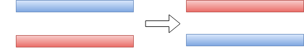

    Inefficient in a high-dimensional setting
--
2. **Genetic algorithms**:

    One-point **crossover** (using Metropolis-Hastings to accept/reject)

    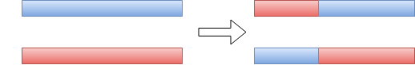
    
---
# Augmented Ensemble MCMC


We construct an auxiliary variable Gibbs sampler, using a one-point crossover

---
background-image: url(fig/schema_crossover_step1.png)
background-position: 50% 90%
background-size: 70%

# Augmented Ensemble MCMC


We construct an auxiliary variable Gibbs sampler, using a one-point crossover

1. Introduce auxiliary variables $(\boldu, \boldv) \sim p(\boldu, \boldv | \boldx_i, \boldx_j)$

     * Uniform distribution over all crossovers of $(\boldx_i, \boldx_j)$


---
background-image: url(fig/schema_crossover_step2.png)
background-position: 50% 90%
background-size: 70%

# Augmented Ensemble MCMC


We construct an auxiliary variable Gibbs sampler, using a one-point crossover

1. Introduce auxiliary variables  $(\boldu, \boldv) \sim p(\boldu, \boldv | \boldx_i, \boldx_j)$

     * Uniform distribution over all crossovers of $(\boldx_i, \boldx_j)$

2. Generate $(\boldx_i, \boldx_j) \sim p(\boldx_i, \boldx_j | \ee)$, where
$$\begin{align*}
p(\boldx_i, \boldx_j | \ee) &= \frac{1}{Z} \pi_i(\boldx_i) \pi_j(\boldx_j)  p(\boldu, \boldv | \boldx_i, \boldx_j) \\
&= \frac{1}{Z} \pi_i(\boldx_i) \pi_j(\boldx_j)  p(\boldx_i, \boldx_j | \boldu, \boldv) \\
&= \frac{1}{Z} \pi_i(\boldx_i) \pi_j(\boldx_j) I((\boldx_i, \boldx_j) \in \text{Crossover} (\boldu, \boldv)) 
\end{align*}$$

---

# Augmented Ensemble MCMC

The auxiliary variable construction can be treated as a marginal proposal

$$\begin{align*}
Q(\boldz_i, \boldz_j | \boldx_i, \boldx_j) 
&= \iint \frac{1}{Z} \pi_i(\boldz_i) \pi_j(\boldz_j) p(\boldz_i, \boldz_j | \boldu, \boldv) p(\boldu, \boldv | \boldx_i, \boldx_j) d\boldu d\boldv \\
&= \pi_i(\boldz_i) \pi_j(\boldz_j) \iint \frac{1}{Z} p(\boldz_i, \boldz_j | \boldu, \boldv) p(\boldx_i, \boldx_j | \boldu, \boldv) d\boldu d\boldv \\
&= \pi_i(\boldz_i) \pi_j(\boldz_j) H(\boldz_i, \boldz_j | \boldx_i, \boldx_j).
\end{align*}$$

--

The Metropolis-Hastings acceptance probability
$$\begin{align*}
\alpha 
%= \frac{p(\boldz_i, \boldz_j) Q(\boldx_i, \boldx_j | \boldz_i, \boldz_j)}{p(\boldx_i, \boldx_j) Q(\boldz_i, \boldz_j | \boldx_i, \boldx_j)}
&= \frac{\pi_i(\boldz_i) \pi_j(\boldz_j) Q(\boldx_i, \boldx_j | \boldz_i, \boldz_j)}{\pi_i(\boldx_i) \pi_j(\boldx_j) Q(\boldz_i, \boldz_j | \boldx_i, \boldx_j)} 
= \frac{\pi_i(\boldz_i) \pi_j(\boldz_j) \pi_i(\boldx_i) \pi_j(\boldx_j) H(\boldx_i, \boldx_j | \boldz_i, \boldz_j)}{\pi_i(\boldx_i) \pi_j(\boldx_j) \pi_i(\boldz_i) \pi_j(\boldz_j) H(\boldz_i, \boldz_j | \boldx_i, \boldx_j)}.
\end{align*}$$

--

Since $H(\boldz_i, \boldz_j | \boldx_i, \boldx_j) = H(\boldx_i, \boldx_j | \boldz_i, \boldz_j)$ due to symmetry, $\alpha = 1$.

---

# Toy example

Consider the following distribution over binary vectors with two separated modes:

.pull-left[

]
.pull-right[
$$p(\boldx) \propto \alpha^{\min(\dist(\boldx,\, \boldx^{\text{mode}_1}),\; \dist(\boldx,\, \boldx^{\text{mode}_2}))}$$
]

--

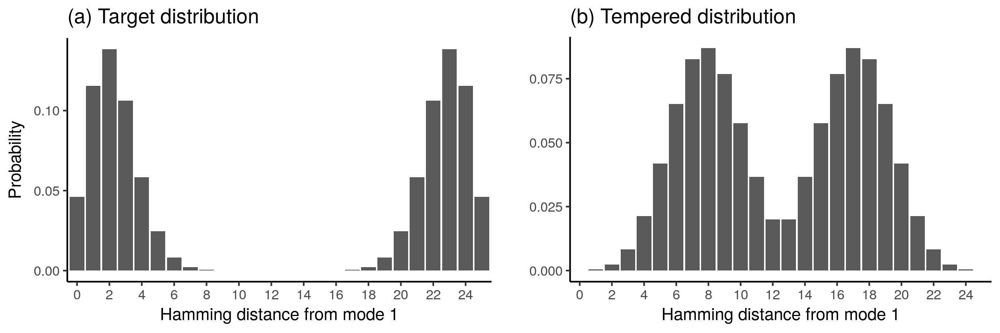

---
background-image: url(fig/toy_multimodal.png)
background-position: 50% 80%
background-size: 60%

# Toy example extended

Divide $\boldx$ into $B$ blocks, within each block bimodal distribution. 

$$p(\boldx) \propto \prod_{j=1}^B p(\boldx^{(j)}) = \prod_{j=1}^B \alpha_j^{\min(\dist(\boldx^{(j)},\, \boldx^{\text{mode}_1}),\; \dist(\boldx^{(j)},\, \boldx^{\text{mode}_2}))}$$

Results in a total of $2^B$ modes:

---

# Toy example: comparison of samplers


* Single chain Gibbs sampler
* Ensemble of Gibbs samplers (two chains: $T_1 = 1$, $T_2 = 4$), 
--
using the following exchange moves
    * Swap (accept/reject)
    * Uniformly chosen crossover (accept/reject)
    * Augmented crossover

--

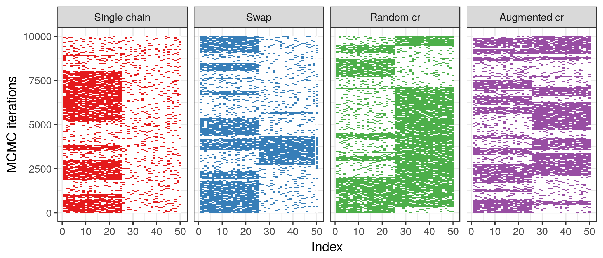
---

# Toy example: comparison of samplers

With 5 blocks:

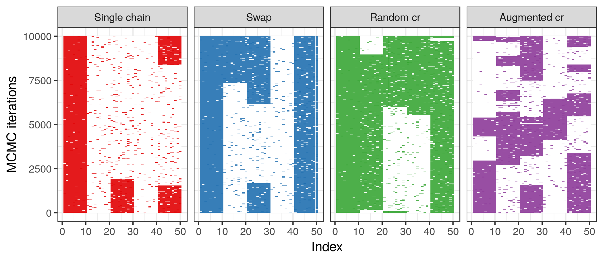
---

# Toy example: comparison of samplers

With 10 blocks:

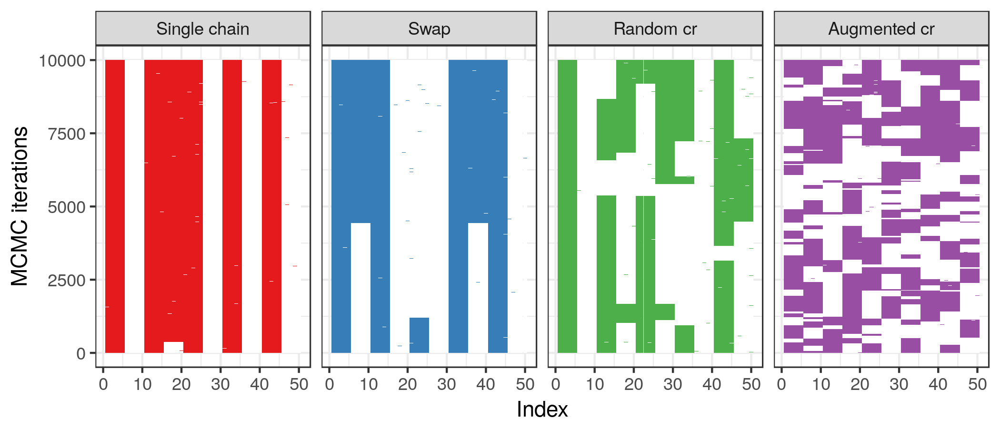

---

# Toy example: comparison of samplers

Number of mode jumps (cumulative)

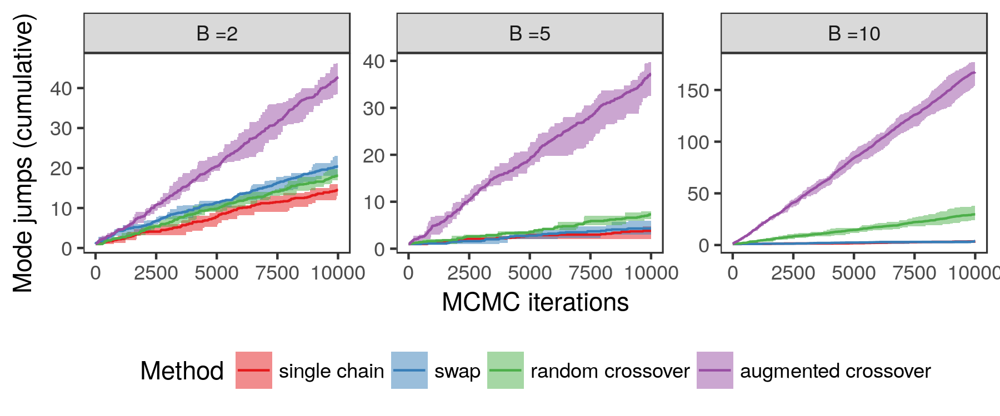
---

# Factorial HMM

Standard HMM:

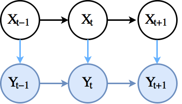

---

# Factorial HMM

Extension of HMM: multiple latent sequences. We focus on: binary $\boldX$

.pull-left[

]

---

# Factorial HMM

.pull-left[
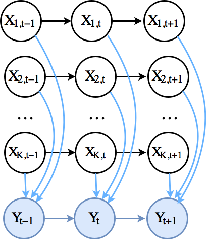
]

.pull-right[
$$\begin{align*} 
(w_1, \ldots, w_K) &\sim \text{Dir}(\alpha, \ldots, \alpha) \\
Y_t | X_{:, t}, w &\sim \mathcal{N}\left(\sum_{k=1}^K w_k X_{k, t}, \; \sigma^2\right)
\end{align*}$$

]


---

# Factorial HMM

.pull-left[

]

.pull-right[
$$\begin{align*} 
(w_1, \ldots, w_K) &\sim \text{Dir}(\alpha, \ldots, \alpha) \\
Y_t | X_{:, t}, w &\sim \mathcal{N}\left(\sum_{k=1}^K w_k X_{k, t}, \; \sigma^2\right)
\end{align*}$$


Inference by Gibbs sampling:

1. Sample $\boldw | Y, X$ 
    * e.g. by random walk MH
2. Sample $X | \boldw, Y$
    * Full FB recursion becomes quickly infeasible, due to complexity $O(2^{2K}T)$
    * Solutions:
        * Update one row of $X$ conditional on the rest
        * Hamming Ball sampling (Titsias and Yau, 2017)
]

---

# Hamming Ball sampling for Factorial HMM

Update for column $\boldx_t$ illustrated for Hamming Ball $(r=1)$ sampling

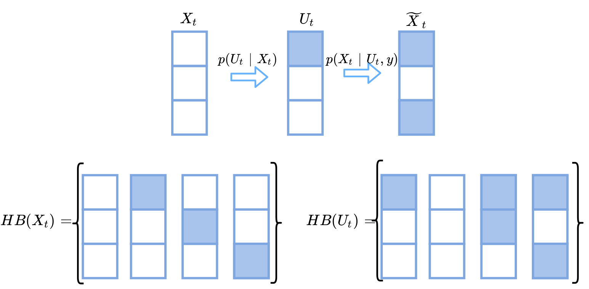

---

# Augmented crossover for Factorial HMMs

1. How to extend the auxiliary variable crossover move to multiple latent sequences?

--

2. How to efficiently compute $\pi(\boldz_i)^{\beta_i} \pi(\boldz_j)^{\beta_j}$ for every pair $(\boldz_i, \boldz_j) \in \text{Crossover}(\boldu, \boldv)$

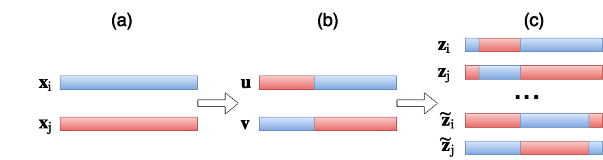

These can be computed in $O(K T)$.

---

# Factorial HMM application

Motivated by a cancer genomics

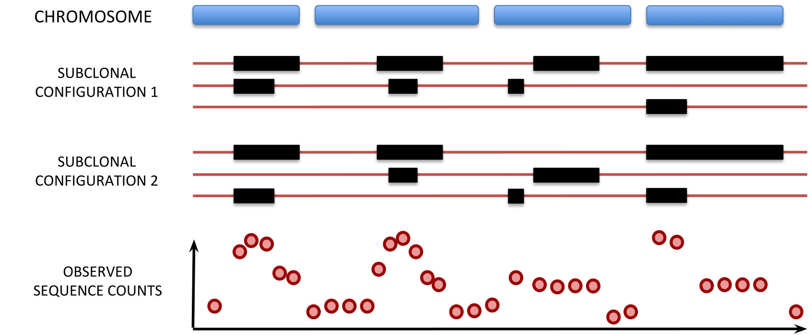

---

# Factorial HMM example

Consider the following example ( $K=3$) with multiple underlying explanations, due to $w_1 + w_2 \approx w_3$

$$\begin{align*} 
Y_t | X_{:, t}, w &\sim \mathcal{N}\left(\sum_{k=1}^K w_k X_{k, t}, \; \sigma^2\right)
\end{align*}$$

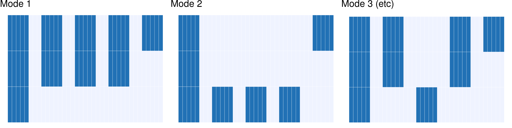
---
# Factorial HMM example

Gibbs sampler + ensemble versions:

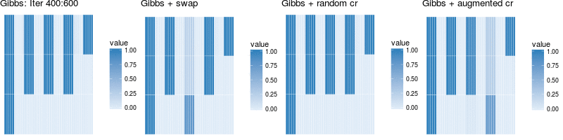

Hamming Ball sampler + ensemble versions:

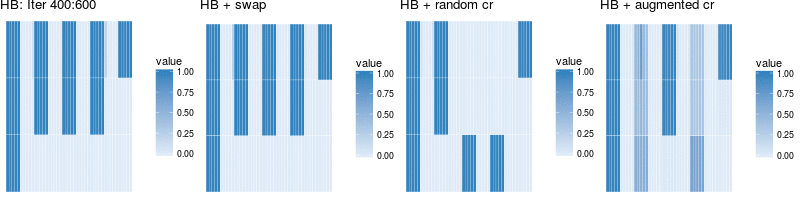

---
# Factorial HMM example - extended

Gibbs sampler + ensemble versions:

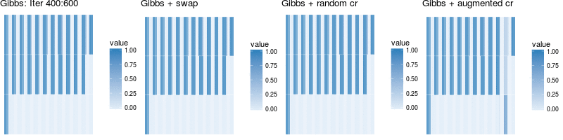

Hamming Ball sampler + ensemble versions:

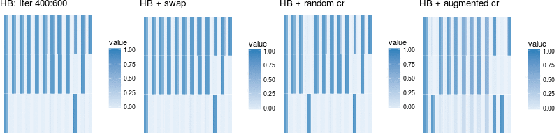

---
background-image: url(fig/logposterior.png)
background-position: 50% 60%
background-size: 100%

# Factorial HMM example

log-posteriors

---
class: inverse, middle, center
background-image: url(fig/schema_crossover_without_labels.png)
background-position: 50% 65%
background-size: 40%

# Augmented Ensemble MCMC with applications to Factorial HMMs

Kaspar Märtens, Michalis Titsias, Christopher Yau

https://arxiv.org/abs/1703.08520


<br/> <br/> <br/> <br/> <br/> 

kaspar.martens@gmail.com

<link rel="stylesheet" href="https://cdnjs.cloudflare.com/ajax/libs/font-awesome/4.7.0/css/font-awesome.min.css">

<a href="#" class="fa fa-twitter"></a>  @kasparmartens
